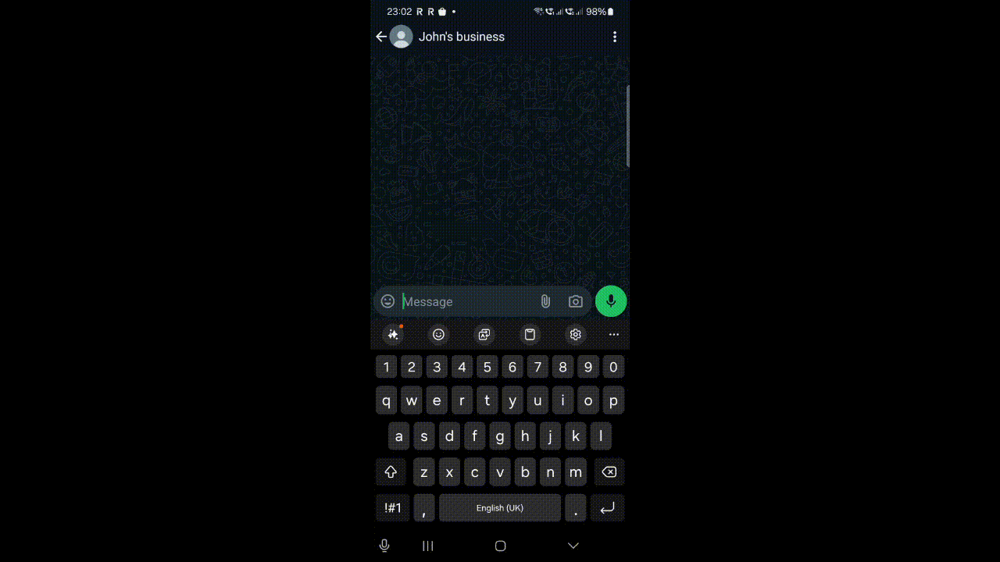
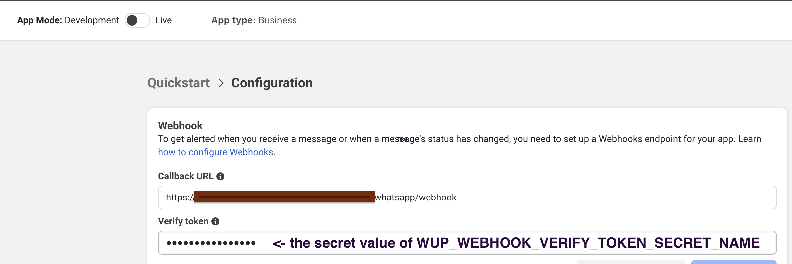
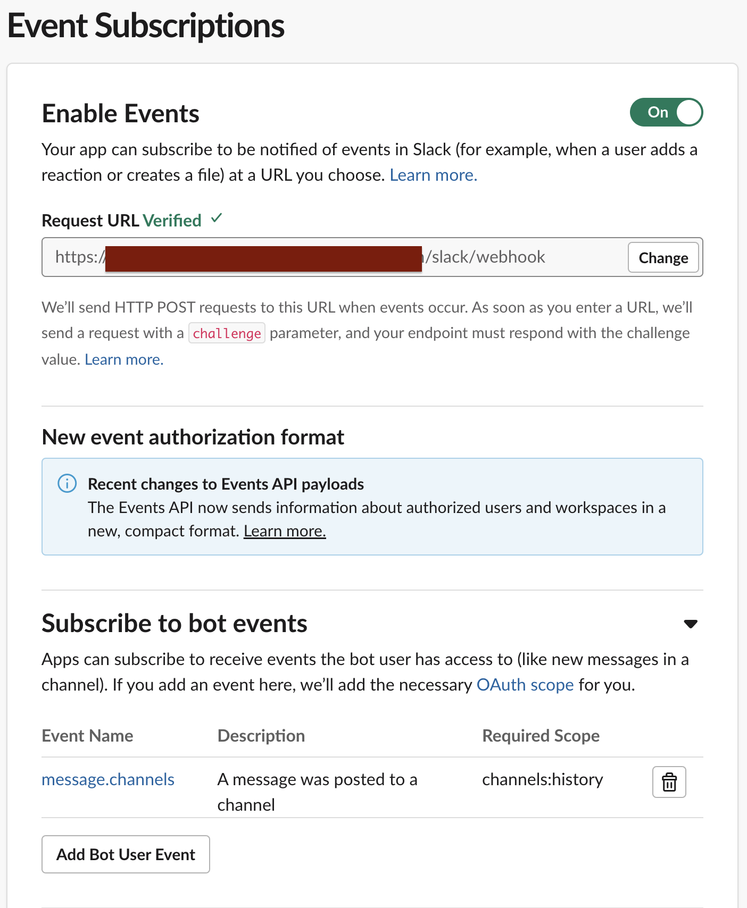

# wup2slack (POC)
WhatsApp Business Platform to Slack message forwarding.



### 1. Create a WhatsApp Business Platform App
https://developers.facebook.com/docs/whatsapp/cloud-api/get-started
### 2. Create a Slack app and install it in your workspace
https://api.slack.com/apps?new_app=1
### 3. Update app.yml and deploy code to Google cloud App Engine
```shell
gcloud app deploy
```
### 4. Register your App Engine url as webhook for Whatsapp
```shell
https://<your app egine url>/whatsapp/webhook

```

Don't forget to subscribe to "messages" callbacks (or subscribe to all callbacks).
### 5. Register your App Engine url as event lister for Slack events
```shell
https://<your app egine url>/slack/webhook
```
Configure Request URL and subscribe to `message.channels` bot event.

### 6. Send a whatsapp message to your Whatsapp Business Platform number. Reply from Slack.